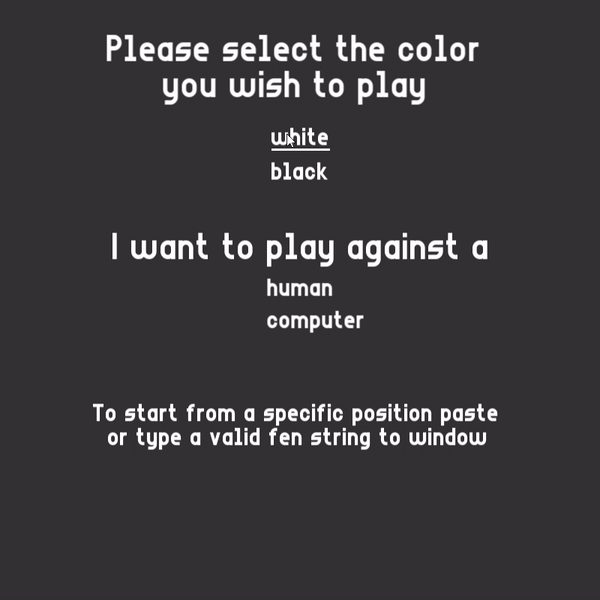

# Chess Engine and GUI

Chess application developed as a bonus project for Advanced Programming subject at TUM. GUI was implemented using SFML library.



## Engine Search:
- NEGAMAX (minimax variant) with Alpha-Beta pruning.
- Bit board approach.
- Iterative Deepening.
- Transposition Table (Zobrist Hashing).
- Move Ordering.
- MVV/LVA.
- Piece-Square Tables.
- Mop-up Evaluation.
- Quiescence Search.
- Pawn Shield.
- Opening Book (currently uses 4469 GM games parsed from PGNs: https://www.pgnmentor.com/files.html#openings).
#### Move Generation Correctness:
- **PERFT** tests done on 132 different positions, evaluated to depth 5.


## Requirements
* **CMake** (minimum required VERSION 3.22) with **Ninja** generator.
* Compiler:
    - **MSVC** with C++ 17 (Microsoft Visual Studio 2022 (MSVC 14.38.33130)),
    - **g++** with C++ 17 (gcc 11.4.0).
* SFML and spdlog are automatically fetched with this CMake configuration.

## Build Instructions

### Setting Up the MSVC Environment for CMD Build (Windows):
1. Open a terminal and run:
```console
call <path to vcvarsall.bat> x64 && cmd
```
- For example run: `call "C:\Program Files\Microsoft Visual Studio\2022\Community\VC\Auxiliary\Build\vcvarsall.bat" x64 && cmd`.

2. Alternatively, set up the environment using the Visual Studio Developer Command Prompt:
- Open the `x64 Native Tools Command Prompt`.
- Ensure the environment is initialized for `x64`. If not, run `vcvarsall.bat x64`.

3. Verify that the environment is set up by calling `cl`. (This checks if the MSVC compiler is available.)

### Building with Visual Studio:
- Open the CMake project directly with Visual Studio.

### Installing SFML Dependencies on Linux:
Run the following commands in your terminal:
```console
sudo apt-get update
sudo apt-get install \
    libxrandr-dev \
    libxcursor-dev \
    libudev-dev \
    libfreetype-dev \
    libopenal-dev \
    libflac-dev \
    libvorbis-dev \
    libgl1-mesa-dev \
    libegl1-mesa-dev
```
- If there is an issue with `ft2build.h`, add the following directories to your `$PATH`:
    - `/usr/include/freetype`
    - `/usr/include/freetype2`

### Building the Project with CMake:

1. Configure the project:
```console
cmake --preset <Release/Debug>
```
2. Build the project:
```console
cmake --build --preset <Release/Debug> --parallel
```

#### Notes:
- **These instructions apply to all build configurations** (Debug, Release).
- Warnings are treated as errors.
- Warning levels are increased (check `CMakeLists.txt` for compile flags).

## How to Run
1. Navigate to the Build Directory:
```console
cd build/<Release/Debug>
```
2. Run the Executable:
    - On Linux:
    ```console
    ./chess_ai
    ```
    - On Windows:
    ```console
    chess_ai.exe
    ```
3. Logging
- The logger file is created in the build directory.

## Testing
Run tests with the following command:
```console
cd build/<Release/Debug>
ctest -R ^<unit_tests/performance_tests>$
```

## Contributing
- Use camel case.
- Use **`.clang-format`** to format code.
- Set auto format on.
- `clang-format` minimum required version `14.0.0`.

## Literature
- General: https://www.chessprogramming.org/Main_Page
- Overview of the minimax engine: https://www.youtube.com/watch?v=w4FFX_otR-4&list=LL&index=2&t=313s
- Bit Boards: https://ameye.dev/notes/chess-engine/
